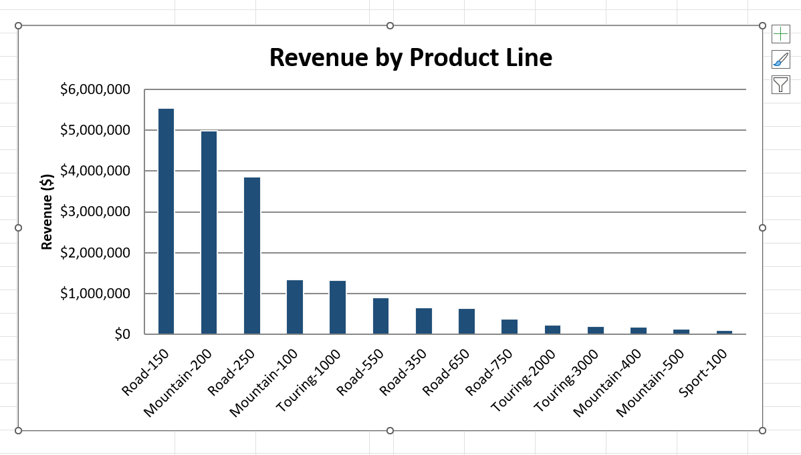
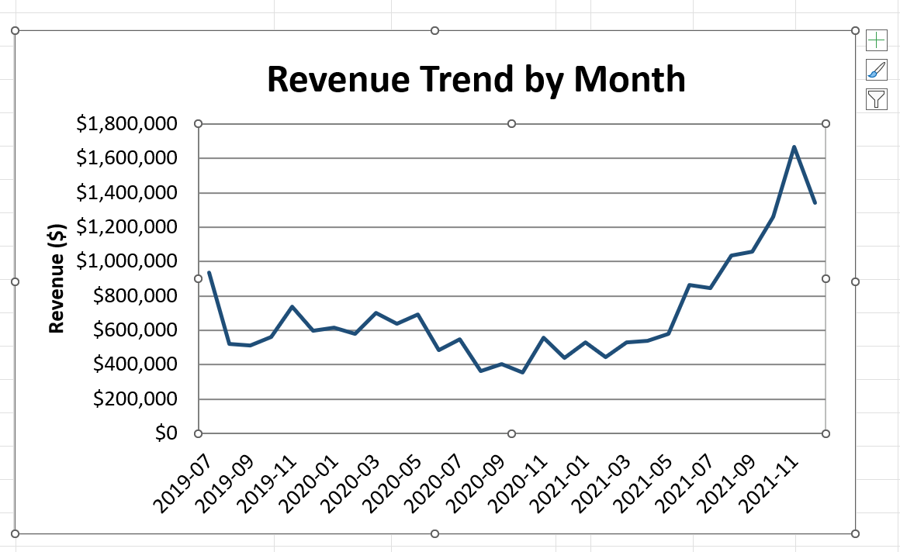
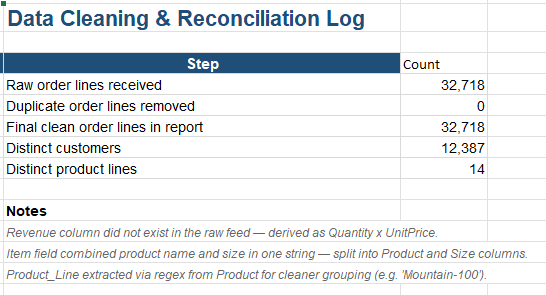

# 📊 Excel Report Automation using Python

An automated Excel reporting solution that transforms raw sales order data into a professional Sales MIS Report.

This project automates repetitive Excel reporting tasks such as data cleaning, validation, KPI calculation, business summaries, chart generation, and workbook formatting, producing a ready-to-share Excel report in a single execution.

---

## 📌 Business Problem

Preparing monthly sales MIS reports manually in Excel is repetitive, time-consuming, and prone to human error.

This project automates the complete reporting workflow by cleaning raw sales data, calculating business metrics, and generating a professionally formatted Excel workbook that can be shared directly with business stakeholders.

---

## 📂 Dataset

**AdventureWorks Sales Dataset**

**Source:**  
https://raw.githubusercontent.com/MicrosoftLearning/dp-data/main/sales.csv

- **32,718** sales order records
- **Date Range:** July 2019 – December 2021

---

## ✨ Features

- Automated Excel report generation
- Data cleaning and validation
- Duplicate record validation
- Customer name encoding fixes
- Product and Size extraction from the combined Item field
- Product Line extraction for business reporting
- Revenue calculation (Quantity × Unit Price)
- Monthly revenue analysis
- Product line performance analysis
- Automated Excel charts
- Data Cleaning & Reconciliation Log
- Professionally formatted Excel workbook

---

## 📊 Excel Report Includes

The generated workbook contains:

- Revenue Trend by Month
- Revenue by Product Line
- Data Cleaning & Reconciliation Log
- Cleaned Raw Sales Data

---

## 🛠 Technologies Used

- Microsoft Excel
- Python
- Pandas
- OpenPyXL

---

## 📁 Project Structure

```text
excel-report-automation-using-python/
│
├── report_generator.py
├── raw_sales_data.csv
├── Sales_MIS_Report.xlsx
├── README.md
├── requirements.txt
├── .gitignore
│
└── images/
    ├── revenue_by_product_line.png
    ├── revenue_trend_by_month.png
    └── reconciliation_log.png
```

---

## ▶️ Installation

Install the required libraries:

```bash
pip install pandas openpyxl
```

---

## ▶️ Run the Project

Generate the Excel report using:

```bash
python report_generator.py raw_sales_data.csv output.xlsx
```

The script automatically cleans the data, performs validations, generates summaries, creates charts, and exports a professionally formatted Excel MIS report.

---

## 📈 Results

- Processed **32,718** sales order records
- Generated a professional **Sales MIS Excel Report**
- Performed duplicate validation (**no duplicate records found**)
- Analyzed **14 product lines**
- Covered sales data from **July 2019 – December 2021**
- Generated an Excel workbook with business charts, summaries, and a reconciliation log

---

## 📷 Sample Output

### Revenue by Product Line



---

### Monthly Revenue Trend



---

### Data Cleaning & Reconciliation Log



---

## 🔄 Data Cleaning Performed

The automation performs the following transformations before generating the report:

- Validates duplicate records
- Fixes customer name encoding issues
- Splits the combined Item field into Product and Size
- Extracts Product Line for business reporting
- Calculates Revenue using Quantity × Unit Price
- Performs reconciliation checks to ensure data integrity
- Exports clean and formatted data into Excel

---

## 💼 Skills Demonstrated

- Excel Report Automation
- MIS Reporting
- Business Reporting
- Data Cleaning
- ETL (Extract, Transform, Load)
- KPI Reporting
- Data Validation
- Excel Formatting
- Python Scripting
- Pandas
- OpenPyXL

---

## 🚀 Future Improvements

- Automated email delivery of reports
- Scheduled report generation using Windows Task Scheduler
- Regional and store-wise sales analysis
- Power BI dashboard integration
- Export reports to PDF
- Interactive Excel slicers and pivot tables

---

## 📜 License

This project is created for educational and portfolio purposes.